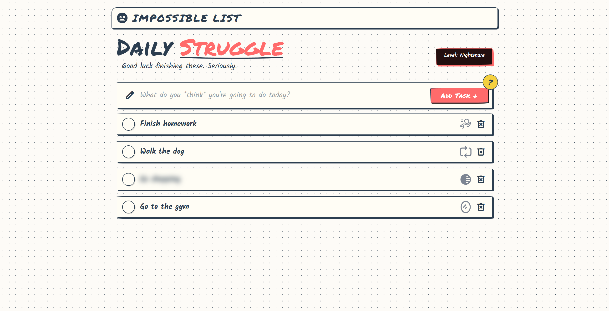

# 🎭 Impossible To-Do List

A playful, hand-drawn style to-do list application that makes task management... well, *impossible*! Each task comes with its own mischievous "troll" behavior that makes completing it a challenge. But don't worry - after a few attempts, the trolls give up and you can actually finish your tasks!



🌐 **Live Demo**: [https://the-impossible-list.onrender.com/](https://the-impossible-list.onrender.com/)

## ✨ Features

### Core Functionality

- ✅ **Add Tasks** - Create new tasks with a simple input field
- 📋 **View Task List** - See all your tasks in a clean, organized list
- ✔️ **Complete/Uncomplete Tasks** - Mark tasks as done (or undo them)
- 🗑️ **Delete Tasks** - Remove tasks you no longer need
- 💾 **Persistent Storage** - All tasks are saved to localStorage and persist across page reloads
- 📱 **Fully Responsive** - Works seamlessly on desktop, tablet, and mobile devices

### Troll System

Each task is randomly assigned one of five troll types when created. These trolls make your life difficult, but they have limited activations based on the difficulty level you choose. After they've exhausted their attempts, tasks behave normally.

#### 🏃 Runaway Card
When you hover over the task card, it moves to a random position within the task list. The card smoothly animates to its new location, making it harder to click. After a few attempts, the card stops running away.

#### 👓 Blurry Vision
The task text is blurry from the moment the card is created, making it difficult to read what the task says. The blur intensity varies based on difficulty level (3px on Easy, 5px on Medium, 8px on Nightmare). The blur only clears when you mark the task as completed.

#### 🪞 Mirror Text
The task text is horizontally flipped (mirrored) when the card is created, making it read backwards. The mirror effect persists until you complete the task, at which point it automatically corrects itself.

#### 🔄 Fake Complete
When you try to complete this task, it moves to the end of the list and appears completed with a strikethrough. However, after 1.5 seconds, it automatically uncompletes itself and stays at the end of the list. You'll need to try completing it multiple times before it actually stays completed.

#### 🤗 Clingy Card
When you try to complete this task, the card detaches from the list and follows your mouse cursor around the screen. The duration depends on difficulty level (1 second on Easy, 1.5 seconds on Medium, 2 seconds on Nightmare). After the clingy period ends, the card returns to normal and you can try completing it again.

### Difficulty Levels

Click the "Level: [Difficulty]" badge in the header to cycle through three difficulty levels:

- **Easy** 🟢 - Trolls activate only 1 time, blur intensity: 3px, clingy duration: 1s
- **Medium** 🟡 - Trolls activate 2 times, blur intensity: 5px, clingy duration: 1.5s
- **Nightmare** 🔴 - Trolls activate 3 times, blur intensity: 8px, clingy duration: 2s (default)

### Visual Indicators

Each task card displays a small icon representing its troll type:
- 🏃 Runner icon for Runaway Card
- 👓 Blur icon for Blurry Vision
- 🪞 Mirror icon for Mirror Text
- 🔄 Repeat icon for Fake Complete
- 👢 Sticky boot icon for Clingy Card

Hover over any troll icon to see a tooltip explaining what that troll does!

### Additional Features

- **Info Popup** - Click the yellow question mark button to learn more about the app
- **Toast Notifications** - Get notified when you change difficulty levels
- **Task Reordering** - Completed tasks automatically move to the end of the list
- **Uncomplete Tasks** - Click a completed task's check button to uncomplete it and move it back to the top

## 🎨 Design

The application features a unique **sketchy, hand-drawn notebook aesthetic** that makes it feel like you're writing in a real notebook:

- **Hand-drawn fonts**: Permanent Marker for headings, Kalam for body text, Patrick Hand for UI elements
- **Irregular borders**: Custom border-radius values that create organic, sketchy shapes
- **Paper texture**: Light beige background (#fdfbf7) with a subtle dotted grid pattern
- **3D shadows**: Bold, hand-drawn style drop shadows that make elements appear lifted from the page
- **Warm color palette**: 
  - Primary coral red (#ff6b6b)
  - Secondary teal (#4ECDC4)
  - Warning yellow (#FFE66D)
  - Dark ink (#2C3E50)
  - Paper white (#fffdf5)

## 🛠️ Technologies

- **HTML5** - Semantic structure
- **CSS3** - Custom styling with:
  - CSS Variables for theming
  - Custom animations and keyframes
  - Responsive media queries
  - Hand-drawn style shapes and shadows
- **Bootstrap 5** - Grid system and responsive utilities
- **Vanilla JavaScript (ES6+)** - All application logic:
  - Event delegation for dynamic elements
  - LocalStorage API for persistence
  - DOM manipulation
  - Troll behavior system
- **Google Fonts** - Custom typography (Permanent Marker, Kalam, Patrick Hand)
- **Material Symbols** - Icon library for UI elements
- **SVG Icons** - Custom troll type indicators

## 📁 Project Structure

```
impossible-to-do-list/
├── index.html          # Main HTML file
├── css/
│   └── styles.css      # All application styles
├── js/
│   ├── app.js          # Main application logic
│   ├── trolls.js       # Troll behavior system
│   └── storage.js      # LocalStorage management
├── assets/
│   ├── preview/
│   │   └── web-preview.png  # Application preview
│   ├── blur-svgrepo-com.svg
│   ├── mirror-1-svgrepo-com.svg
│   ├── repeat-02-svgrepo-com.svg
│   ├── run-sports-runner-svgrepo-com.svg
│   └── sticky-boot-svgrepo-com.svg
└── README.md
```

## 🚀 Getting Started

1. **Clone the repository**
   ```bash
   git clone https://github.com/VarozXYZ/impossible-to-do-list.git
   cd impossible-to-do-list
   ```

2. **Open in a browser**
   - Simply open `index.html` in any modern web browser
   - No build process or dependencies required!

3. **Start using it**
   - Add tasks using the input field
   - Try to complete tasks and experience the troll behaviors
   - Adjust difficulty level using the badge in the header
   - Hover over troll icons to learn what each troll does

## 🎮 How It Works

### Task Creation
When you create a new task:
1. A unique ID is generated
2. A random troll type is assigned from the 5 available types
3. A troll counter is initialized to 0
4. The task is saved to localStorage

### Troll Activation
Each troll has a limited number of activations based on difficulty:
- **Easy**: 1 activation
- **Medium**: 2 activations  
- **Nightmare**: 3 activations

Once a troll has exhausted its activations, the task behaves normally. The troll counter persists across page reloads.

### Task Completion
- When you complete a task, it moves to the end of the list
- Blur and mirror effects are automatically cleared
- You can uncomplete tasks by clicking the check button again
- Uncompleted tasks move back to the top of the list

### Data Persistence
All tasks (including their troll types and counters) are saved to localStorage. Your tasks will persist even after closing the browser.

## 🎯 Use Cases

- **Educational Project** - Learn about DOM manipulation, event handling, and CSS animations
- **Portfolio Piece** - Showcase creative UI/UX design and JavaScript skills
- **Fun Experiment** - Experience a playful take on productivity apps
- **Teaching Tool** - Demonstrate interactive web development concepts

## 📝 Notes

- This is **NOT** a serious productivity app - it's designed to be playful and slightly frustrating
- All troll behaviors are limited and eventually stop, ensuring the app remains usable
- Tasks can always be completed or deleted, even if trolls are active
- The app works entirely client-side - no backend or server required

## 🔧 Browser Support

Works in all modern browsers that support:
- ES6+ JavaScript
- CSS3 (custom properties, animations)
- LocalStorage API
- Flexbox

Tested and working in:
- Chrome/Edge (latest)
- Firefox (latest)
- Safari (latest)

## 📄 License

This project is created for educational purposes.

## 👤 Author

Created as part of a web development course project.

---

**Remember**: The trolls are just having fun with you! After a few attempts, they'll give up and let you complete your tasks. 😄
